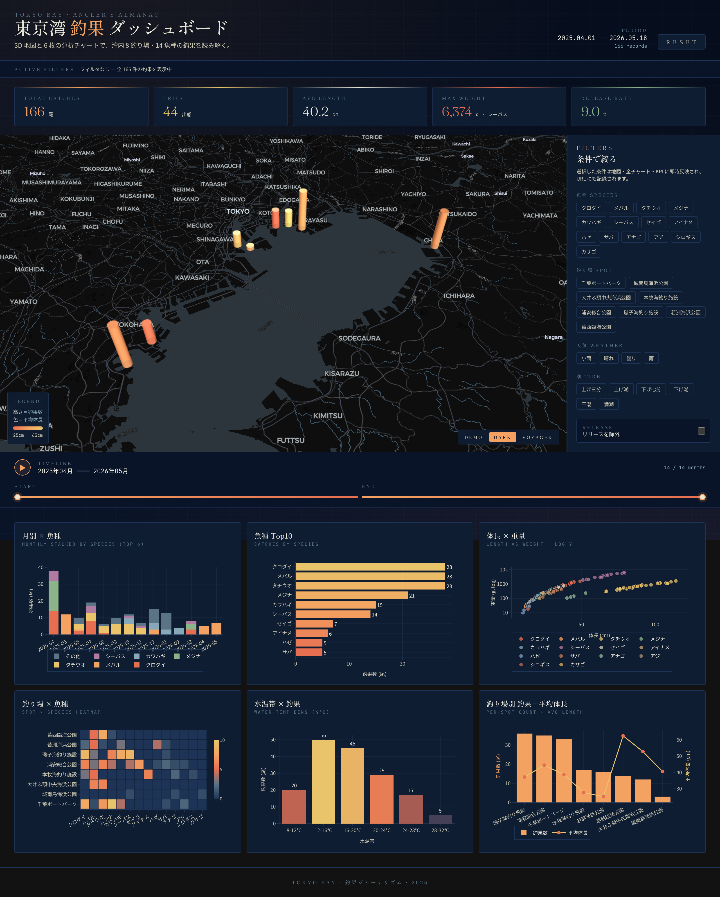
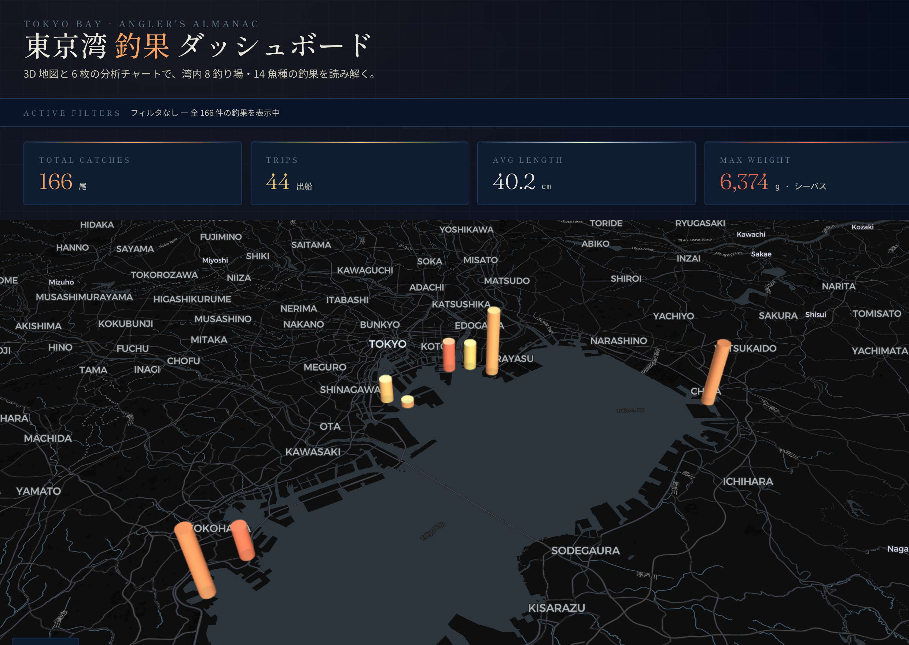
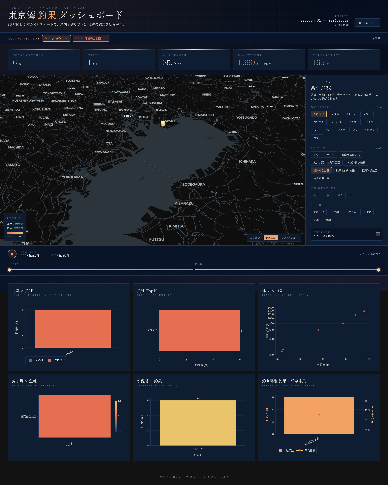

# 東京湾 釣果ダッシュボード

東京湾の釣果データを **3D 地図 + 6 枚の 2D 分析チャート** で可視化し、さらに
**釣果の入力・写真・予報・オフライン対応**まで備えた、釣りジャーナリズム志向の
ダークテーマ SPA です。Kepler.gl 風の地理可視化と Superset 風の BI ダッシュボードを
1 画面に同居させ、現場の入力から振り返りの分析までを 1 つの「釣りアルマナック」にまとめています。

🌅 **ライブデモ**: <https://satoru-oka.github.io/fishing-dashboard/>



ヘッダー直下に「アクティブフィルタ」ストリップ、5 枚の KPI カード、左に 3D マップ、
右にフィルタパネル、その下にタイムスライダー・写真ギャラリー・おすすめ・予報、最下部に
6 枚の Plotly チャートが並びます。

## 目次

- [主な機能](#主な機能)
- [スクリーンショット](#スクリーンショット)
- [クイックスタート](#クイックスタート)
- [技術スタック](#技術スタック)
- [ファイル構成](#ファイル構成)
- [デザイン](#デザイン)
- [スクリプト](#スクリプト)
- [デプロイ](#デプロイ)
- [依存ライブラリのライセンス](#依存ライブラリのライセンス)

## 主な機能

### 可視化

- **3D マップ（deck.gl + MapLibre）**
  - 釣り場ごとに 3D カラム。高さ = 釣果数、色 = 平均体長（コーラル→金）
  - マウント時に高さが伸びるアニメーション（deck.gl のトランジション）
  - ホバーでツールチップ、クリックで「その釣り場のみ」フィルタ
  - マップスタイル切替: Demo / Dark / Voyager
- **KPI Strip**: 総釣果・釣行数・平均体長・最大重量（魚種）・リリース率
- **6 枚チャート（Plotly）**
  - 月別 × 魚種（積み上げ棒, top6 + その他）
  - 魚種 Top10（横棒, クリックで魚種フィルタ）
  - 体長 × 重量（散布図, log Y, 色 = 魚種）
  - 釣り場 × 魚種 ヒートマップ（夕焼けカラースケール）
  - 水温帯別 釣果（4°C ビニング）
  - 釣り場別 釣果 + 平均体長（棒 + 折れ線, デュアル軸）

### 探索（クロスフィルタ）

- **フィルタパネル**: 魚種・釣り場・天気・潮 のマルチセレクト + リリース除外トグル
- **時間軸スライダー**: 開始 / 終了月の双方向レンジ + ▶再生（1 ヶ月ずつ 500ms 間隔）
- **URL 同期**: フィルタ状態が `?from=…&species=…` の形で URL に反映され、共有可能
- フィルタ・地図クリック・チャートクリックはすべての KPI / 地図 / チャートに即時連動

### 入力

- **釣果入力フォーム**: ヘッダーの「+ 釣果を追加」から起動。地図の海面をクリックすると
  その緯度経度を初期値にしてフォームが開く（クリックして追加）
- **下書きの自動保存**: 入力途中の内容を localStorage に保存し、オフラインや再読込でも復元

### 予報・おすすめ

- **次に釣れそうな日（Forecast）**: 過去釣果から季節周期（Fourier 第 1〜3 次）を抽出し、
  向こう 30 日のスコアをカレンダーヒートマップで表示。推論はすべてブラウザ内で完結
- **明日の釣り場おすすめ（Recommendation）**: Open-Meteo の天気・海況予報 + 過去釣果の
  月別実績 + 簡易潮汐推定でスコアリングし、おすすめ釣り場を並べる

### 写真・データ入出力・オフライン

- **写真ギャラリー**: 釣果写真を一覧 + ライトボックス表示。HEIC は `heic2any` で変換
- **CSV 入出力**: フィルタ後の釣果を CSV 書き出し / 既存データへマージ読み込み
- **PWA / オフライン**: Service Worker でアプリと地図タイル・予報レスポンスをキャッシュ。
  オンライン状態インジケータ付きで、オフラインでも閲覧・下書き入力が可能

## スクリーンショット

### 3D マップ詳細



deck.gl の `ColumnLayer` で釣り場ごとに立体カラム。高さ = 釣果数、色 = 平均体長
（コーラル→金）。左下に凡例、右下にマップスタイル切替（Demo / Dark / Voyager）。

### フィルタ適用後（魚種 × 釣り場のクロスフィルタ）



URL クエリ（例 `?species=クロダイ&spots=浦安総合公園`）をそのまま開いた状態。アクティブ
フィルタピルに条件が表示され、KPI・地図・6 枚チャートすべてが連動して絞り込まれる。
リンクを共有すれば同じビューを再現できる。

## クイックスタート

### 前提条件

- Node.js 20.19+ / 22.12+（Vite 8 の要件）。npm が使えること
- 外部のマップトークン（Mapbox 等）は**不要**です

### データ

アプリの起動には `data/catches_enriched.csv` がリポジトリ直下の `data/` に置かれていることが前提です。
Vite の dev サーバーが `/data/*.csv` を該当フォルダから配信します（ビルド時は `dist/data/` にコピー）。
セキュリティのため `.csv` 以外と `data/` 外へのパスは 404 になります。

> `data/tokyo_bay_stations_geo.csv` は将来の拡張用のリファレンス（東京湾の観測所メタ）。
> 現状アプリ本体は参照していませんが、`data/` 配下にあるため dev / build どちらでも配信対象になります。

### 起動

```bash
npm install
npm run dev
```

ブラウザで <http://localhost:5173> を開きます。

## 技術スタック

| 層 | 採用 |
| --- | --- |
| ビルド | Vite 8 + React 18 + TypeScript |
| 3D 地図 | deck.gl 9 / react-map-gl / maplibre-gl |
| 2D チャート | plotly.js-dist-min / react-plotly.js |
| スタイル | Tailwind CSS v4 |
| 予報 | 自前の季節周期分解（Fourier）/ Open-Meteo API |
| 写真 | heic2any（HEIC → 表示用変換） |
| オフライン | vite-plugin-pwa（Workbox） |
| CSV | papaparse |
| 日付 | date-fns |
| 状態 | React Context + useReducer |
| テスト | Vitest |

## ファイル構成

```
fishing-dashboard/
├── data/                            # 入力 CSV（リポジトリ直下に配置）
├── src/
│   ├── main.tsx
│   ├── App.tsx
│   ├── index.css
│   ├── theme.ts
│   ├── types.ts
│   ├── lib/
│   │   ├── csv.ts                   # CSV 読み込み / 書き出し
│   │   ├── aggregations.ts          # KPI・各チャートの集計
│   │   ├── url-state.ts             # フィルタ ⇄ URL クエリ
│   │   ├── forecast.ts              # 季節周期分解 →「次に釣れそうな日」
│   │   ├── recommendation.ts        # おすすめ釣り場スコアリング
│   │   ├── weather.ts / tide.ts     # Open-Meteo 天気・海況 / 潮汐推定
│   │   ├── photo.ts / heic.ts       # 写真・HEIC 変換
│   │   ├── local-store.ts           # 下書き保存
│   │   └── online-status.ts         # オンライン状態
│   ├── context/
│   │   └── DataContext.tsx
│   └── components/
│       ├── Header.tsx / ActiveFilters.tsx / KpiStrip.tsx
│       ├── Map3D.tsx / FiltersPanel.tsx / TimeSlider.tsx
│       ├── CatchForm.tsx            # 釣果入力フォーム
│       ├── PhotoGallery.tsx         # 写真ギャラリー
│       ├── Recommendations.tsx      # 明日の釣り場おすすめ
│       ├── ForecastView.tsx         # 次に釣れそうな日
│       ├── CsvMenu.tsx              # CSV 入出力メニュー
│       ├── ChartsGrid.tsx
│       └── charts/...               # 6 枚の Plotly チャート
├── index.html
├── vite.config.ts                   # data 配信プラグイン + PWA 設定
├── tailwind.config.ts
└── tsconfig*.json
```

## デザイン

- コンセプト: **「夕焼けの東京湾」**
- パレット: ダークネイビー基調にコーラル / ゴールド / アンバー
- タイポ: Fraunces + Shippori Mincho B1（見出し）/ Noto Sans JP（本文）/ JetBrains Mono（数字）
- モーション: マウント時のステージング・フェードイン、3D カラムの高さアニメーション、Plotly 300ms トランジション

## スクリプト

| コマンド | 内容 |
| --- | --- |
| `npm run dev` | dev サーバー起動（HMR） |
| `npm run build` | 型チェック + 本番ビルド |
| `npm run preview` | ビルド結果をローカル配信 |
| `npm test` | Vitest でユニットテスト実行 |
| `npm run lint` | ESLint |

## デプロイ

`main` ブランチへの push で GitHub Actions が自動ビルドし、GitHub Pages へデプロイします
（ワークフロー定義: `.github/workflows/deploy.yml`）。CI（lint / test / build）は
`.github/workflows/ci.yml`、依存更新は `.github/dependabot.yml` で管理しています。

## 依存ライブラリのライセンス

deck.gl (MIT) / Plotly.js (MIT) / MapLibre GL (BSD-3) — いずれも商用利用可。
