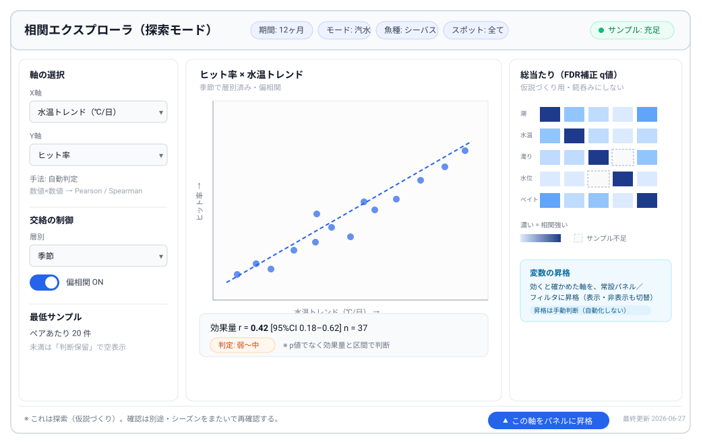

# 設計判断の参考情報（出典つき）

> このドキュメントは、深掘り分析ダッシュボード（[#65](https://github.com/satoru-oka/fishing-dashboard/issues/65)）と統合方針（[#40](https://github.com/satoru-oka/fishing-dashboard/issues/40)）の設計判断にあたって**参考にした外部情報**を、出典リンク付きで残すもの。
> 目的は、後から「なぜこの判断にしたか」を、根拠の出どころごと辿れるようにすること。文章はやさしい言葉に直しているが、主張の中身（＝参考にした事実）はそのまま残している。
>
> 関連: 指標定義 [`docs/field-glance-metrics.md`](./field-glance-metrics.md) ／ 全体像 [`docs/architecture-overview.md`](./architecture-overview.md) ／ たたき台 [`docs/deep-dive-dashboard-draft.md`](./deep-dive-dashboard-draft.md)

## 0. 前提（このアプリの目的）

- **対象魚**: **全魚種**。魚種を問わない釣果管理・分析の基盤アプリにする。**現在の個人的なメインターゲットがシーバス（多摩川・感潮河川／汽水）**で、本書ではこれを具体例（ワークドエグザンプル）として使うだけ。システムをシーバス専用にする意味ではない。
- **目的**: 釣果を上げること。そのための釣果管理・分析アプリ。
- **方針**: 淡水・汽水・海水の**どのフィールド・どの魚種でも使える**、柔軟で拡張できるシステムにする。

「どの変数が効くか」は魚種・フィールドで変わる。だから**魚種ごとに信号セットを持ち替える**（変数レジストリ）前提にし、固定の正解は埋め込まない。1-2 のシーバスは「魚種特有の信号をどう拾うか」の一例（→ 1-2）。

---

## 1. どの条件が釣果に効くのか（信号の強さ）

どの変数をパネルや分析の軸にするかは、その変数が本当に釣果と関係するかで決める。
釣り界で人気の条件ほど、よく調べると**弱かったり、他の条件と一緒に動いているだけ（交絡）**だったりする点に注意。

### 1-1. 魚種共通の傾向（強さの目安）

| 条件 | 強さ | 要点 | 出典 |
|---|---|---|---|
| 潮・流れ | 強（特に海・汽水） | 動く潮そのものが捕食スイッチになり、他の条件を上書きすることも多い。上げ潮はベイトを運び捕食を誘発 | [In The Spread][b-tide]／[AMI][b-ami] |
| 水温 | 強 | 代謝・在処・捕食強度を左右する基幹変数。絶対値より「変化の方向・速さ」が効く。種ごとに最適域が違う | [Best Days to Fish][w-temp]／[Fishing&Fish][w-fish] |
| 時間帯（まづめ） | 中〜強 | 夜明け・夕暮れの捕食ピークは広く観測される | （1-2 のシーバス出典を参照） |
| 気圧 | 弱・交絡 | 最も引用される 1983 年の bass 研究も効果は小さく一部の季節でのみ有意で、同時に動く風・雲・雨と分離できていない。海産種の追試は概ね効果なし。2006 年の Fisheries 誌レビューも直接効果の一貫した証拠はなしと結論。気圧は**天候パターンの指標**と捉えるのが妥当 | [NewsWire（研究レビュー）][p-news]／[Active Angling NZ][p-anz] |
| 月齢・ソルナー | 弱（直接効果） | 淡水トラウトの対照研究で、努力あたり釣果はどのソルナー値・月相・月明かりとも有意な関係がなく、気温の方がよい予測子だった。月が現実に効くのは**主に潮汐を介した経路** | [Springer（対照研究）][m-springer]／[In The Spread][m-its] |

**含意（決定A）**: 信号の強い変数（潮・サイズ・種・タックル）は妥当だが、**水温・時間帯も強い信号なのに 5 パネルが直接は拾えていない**のが抜け。気圧・月齢はコア化しない（→ 実験層・相関エクスプローラの題材にまわす）。

### 1-2. シーバス（多摩川・河川）で特に効く条件（魚種別の具体例）

> ※ これは「魚種特有の信号をどう特定するか」の一例。他魚種（メバル・クロダイ・トラウト・バス等）では効く条件が替わるので、**魚種ごとに信号セットを差し替える**（変数レジストリ）。全魚種で固定の正解はない、という前提を示すための例示。

シーバスは偏食で、**ベイト（餌の小魚）と潮・濁り**に強く反応する。河川・河口（感潮域）が舞台だと、海の潮汐に加えて**増水・放水・水位**が時合を作る。

| 条件 | 要点 | 出典 |
|---|---|---|
| 潮の動き・潮位 | 潮が動く時によく食う。潮止まりは落ちる。下げ5分〜ド干潮、ド干潮からの上げがチャンス。ベイトと一緒にシーバスも差してくる | [釣りサクサク][s-saku]／[釣りハック][s-hack] |
| ベイトパターン | シーバスは偏食。季節でベイトが替わる（バチ抜け→稚アユ→イワシ→落ちアユ→コノシロ等）。今追っているベイトに合わせるかで釣果が大きく変わる | [釣りクラウド][s-cloud]／[デュエル][s-duel] |
| 時間帯・夜 | 夜行性。朝・夕マズメと夜が基本。マズメはベイトが動き出すので時合になる | [釣りサクサク][s-saku]／[fishing-rungun][s-rungun] |
| 水温・季節 | 適水温はおおむね 10〜24℃。春（バチ抜け）と秋（産卵前の荒食い）がトップ、真夏・真冬は厳しい。気温と水温のタイムラグも意識 | [シーバスルアースタジオ][s-studio]／[デュエル][s-duel] |
| 濁り（雨後・梅雨） | 雨で濁りが入ると警戒心が下がり、日中でも釣りやすくなる | [釣りング][s-tsuring]／[fishing-rungun][s-rungun] |
| 増水・放水・水位（河川） | ダム放水・水門開閉で増水＆濁りが出ると時合になる。放水時刻を調べておくと拾える | [fishing-rungun][s-rungun] |

**含意（決定A・C）**: 多摩川シーバスでは **水温（＋トレンド）・時間帯・ベイトパターン・濁り・水位／放水**が高信号。今のデータモデル／パネルはこの一部しか拾えていない。
→ これらを「**パネル化**」するか「**分析軸（クロスフィルタ／相関軸）**」として持つかを決めるのが決定A／B の実体（→ 1-3）。

### 1-3. パネル変数の振り分け（クラッタ対策）

変数を全部パネルにすると画面が見にくくなる（1画面 5〜9 要素の原則 → §2）。そこで**役割で振り分ける**と、新規パネルをほぼ増やさずに全変数を使える。

| 変数 | 役割 | 理由 |
|---|---|---|
| 水温（トレンド） | オーバーレイ（釣果推移に重ねる）＋相関軸 | 連続値・トレンド重視。単独パネルより推移と重ねた方が読める |
| 時間帯 | フィルタ（まづめバケツ）＋相関軸 | カテゴリ。絞り込み軸が自然 |
| ベイトパターン | フィルタ（カテゴリ）＋相関軸 | マッチザベイトの検証に相関軸 |
| 濁り | フィルタ（3段階）＋背景バンド＋相関軸 | カテゴリ。日中の濁り効果を相関軸で |
| 水位 | オーバーレイ（推移に重ねる）＋相関軸 | 連続値。放水と連動 |
| 放水 | 推移チャートのイベント縦線＋相関軸 | 離散イベント。時刻メモと時合の対応 |

**振り分けの考え方**:
- **カテゴリ変数（時間帯・ベイト・濁り）→ フィルタ**。絞ると全パネルが連動。新パネル 0。
- **連続値（水温・水位）→ 釣果推移パネルに第2軸で重ねる**。放水は縦線イベント。新パネル 0。
- **全変数（上記＋気圧・月齢）→ 相関エクスプローラの選択軸**。長い尻尾はここに隔離してメイン画面を汚さない。
- 常設パネルの追加は**最大＋1**（コンパクトな「環境サマリ」）に留める。

→ 結論：「クロスフィルタ／相関軸」はクラッタ対策として正解。それに**オーバーレイ**を加えると、**新規パネルはほとんど増やさず**に全変数を分析に使える。

### 1-4. 最終的な1画面の構成（深掘りダッシュボード・案）

役割振り分け（1-3）を反映した、既定 1 画面の中身。クロスフィルタで全連動。相関エクスプローラはこの画面には出さず別モード。

**ヘッダー（操作・要約層）**
- KPI サマリ：総釣果／釣行数／ヒット率／平均サイズ（ボウズ・滞在時間が入れば率を正しく出せる）
- アクティブフィルタチップ：期間・モード(海/汽水/淡水)・**魚種**・スポット・時間帯・ベイト・濁り

**本体パネル（5〜6 枚）**
1. **地図** — 釣果分布。タップで全パネル絞り込み（クロスフィルタ起点）
2. **釣果推移** — 時系列。第2軸に水温／水位を重ね、放水を縦線イベント表示
3. **魚種内訳** — 構成比（全魚種対応の主役パネル。魚種で全体が連動）
4. **サイズ分布** — ヒストグラム（魚種・スポットで連動）
5. **環境×ヒット率** — モードで中身が替わる枠。海/汽水＝潮×ヒット率、淡水＝水温トレンド or 水位×ヒット率
6. **釣法効果** — ルアー／餌のヒット率ランキング

**任意（＋1 枠まで）**：環境サマリ（現在／期間の水温・水位・潮・濁りをコンパクト表示）

水温・時間帯・ベイト・濁り・水位・放水は「パネル」ではなく、**ヘッダーのフィルタ／推移へのオーバーレイ／相関軸**として全部効かせる（新規パネルは実質 0〜1 枚）。全魚種対応では **魚種内訳パネルとフィルタの魚種チップ**が中心軸になる。

---

## 2. 探索ダッシュボードの設計の定石

| 定石 | 要点 | #65 への適用 | 出典 |
|---|---|---|---|
| 1 画面 5〜9 要素まで | 詰め込みすぎは理解を妨げる。最重要 KPI を先頭に、設問に合うチャート型を選ぶ | KPI＋5 パネルで既に上限近辺。**相関エクスプローラを既定画面に足すと過積載** → 別モード／後付けが妥当 | [Improvado][d-impr]／[ThoughtSpot][d-ts] |
| 視覚階層は上＝要約 | 最重要は左上か上中央に、サイズ・太さで強弱を一貫させる | 最上段は要約（KPI＋アクティブフィルタ）、地図は主エリア左、で整合 | [Ask.com][d-ask] |
| クロスフィルタ（1 クリックで全連動） | 地図で選ぶと全チャートが連動する形は、強力で直感的 | 「地図タップ→全パネル連動」は教科書どおり | [TimeTackle][d-tt] |
| 空白で始めない・段階開示 | 意味のある既定ビューから始め、詳細は要求時に出す | **決定D の既定は「公開ビュー」**が有利。個人ビューはトグルで深掘り側 | [TimeTackle][d-tt]／[UXPin][d-uxpin] |
| 重い初期描画は集計サマリ・操作は即応 | 初期は集計サマリ、深い切片はオンデマンド | **決定F**: 重いパネルはサーバ集計（FastAPI）既定、クライアントは描画専念（#40 と一致） | [TimeTackle][d-tt] |
| 鮮度・算出ロジックの透明化 | 最終更新の明示、ツールチップで単位・計算方法を説明 | n=・データ不足表示の原則と同方向。各パネルに窓・最低サンプル・最終更新を添える | [Improvado][d-impr]／[Ask.com][d-ask] |

---

## 3. 相関分析を信頼できるものにする統計

**この章（相関エクスプローラの統計）の役割**: 強い条件（潮・水温・ベイト）は自信を持って直接パネルにしてよい。問題は、**新しく試す変数や二次的な変数が「本当に効くのか」を確かめる**場面。ここで自分を騙さないための門番が相関分析の作法であり、**効くと分かった変数だけパネルに昇格**させるための仕組み（[#40 の「将来拡張の継ぎ目」](https://github.com/satoru-oka/fishing-dashboard/issues/40#issuecomment-4680985071)）。

- **多重比較**: 総当たりヒートマップは生の p 値で塗らない。探索段階は Benjamini-Hochberg の FDR 補正（q 値）が現実的（Bonferroni は厳しすぎ）。ヒートマップは「仮説づくり」、確認は別途、と UI で明示する。
- **交絡の制御**: 潮・水温・季節・時間帯は互いに連動する（→ 1 章。気圧・月齢が「見かけの相関」になるのと同じ理由）。素の相関でなく、月・スポット・water_type で層別するか偏相関で効果を分離する。
- **効果量を主、p 値を従**: サンプルが増えると些細な相関も「有意」になる。r／Cramér's V／η² と信頼区間を前面に、実用的な大きさで語る。
- **型に応じた手法**: 数値×数値＝Pearson（ただし潮回りのような順序や非線形は Spearman）。カテゴリ×数値＝点双列／ANOVA（η²）。カテゴリ×カテゴリ＝Cramér's V。
- **最低サンプルはペア単位で厳しく**: グランスの n=5 は単指標向け。相関は各ペア／各セルで閾値を上げ、満たないペアは「判断保留」で空表示。
- **探索の罠（分岐する小道）**: 探索が無限に走るので、コア仮説（潮×ヒット率など）は先に決め、それ以外は「探索的」と明示。可能ならシーズンをまたいで再確認する。

統計処理は FastAPI 側（pandas / scipy / statsmodels）で行い、ダッシュボードは結果の可視化に専念する（[#40 の方針](https://github.com/satoru-oka/fishing-dashboard/issues/40#issuecomment-4617965788)）。

> 注意（小サンプルの現実）: 個人ログは各セルが薄い。厳密に層別するほどセルが枯れて「判断保留」だらけになりやすい。頻度論の総当たりより、**まず可視化＋シーズンをまたいで再確認**、必要に応じて部分プーリング（hierarchical）寄りの考え方が向く。

---

## 4. 分析の土台で一番効くこと（データの質）

相関の手法を凝る前に、**データの質**を上げる方がリターンが大きい。

### 考え方：「条件（環境）× 行動（アングラーの選択）→ 結果（釣果）」

釣果を上げるには「**どんな条件のとき、どんな行動をしたら釣れたか**」が見えるとよい。それには 3 つを明確に分けて持つ：

| 層 | 例 | 性質 |
|---|---|---|
| 条件（環境・外部） | 潮・水温・天気・月齢・濁り・水位・放水 | アングラーが**制御できない**。できるだけ機械で自動補完 |
| 行動（選択） | スポット・タックル・ルアー・餌・入る時間・滞在時間 | アングラーが**制御できる**。改善のヒントはここ |
| 結果 | 釣果数・サイズ・ヒット率 | 上 2 つの組み合わせの帰結 |

これで「条件Xのとき行動Yが効いた」という、**行動に落とせる示唆**が出せる。

### 努力バイアスを避ける（低コストな質向上）

- 釣れた「数」だけだと「よく行った条件」が上位に出るだけ（使用頻度・努力バイアス）。これは [`field-glance-metrics.md`](./field-glance-metrics.md) が各指標の限界として明記している問題。
- **キャスト数は取らない**（負担が大きい）。代わりに **釣行数＋ボウズ（０尾釣行）＋滞在時間（開始／終了）** を取れば、**時間あたり釣果（率）**が安く作れる。
- **機械で自動補完できる文脈**（潮・水温・天気・月齢・日出日没→時間帯・GPSスポット）はアングラー労力ゼロで質が上がる。**最優先**。
- 低コストな手入力タグ：**ベイト有無／種類・濁り3段階**。

### 拡張性（後から足せる）

質向上は後からでも追加できるようにする。[#40 の継ぎ目](https://github.com/satoru-oka/fishing-dashboard/issues/40#issuecomment-4680985071) の **`extra jsonb` 実験層 ＋ 変数レジストリ**を使うと、新しい因子をマイグレーションなしで追加し、効くと分かったものだけ型付きカラムに昇格できる。

**優先度**: (a) 高信号変数をモデルに持つ（魚種別。シーバス例＝潮の動き・潮位／ベイト／濁り／水位・放水／夜・マズメ） → (b) 努力ログ（釣行・ボウズ・滞在時間） → (c) ラグ特徴量（「N 日前の雨」「水温トレンド」など、瞬間値でなく変化）。

---

## 5. #65 の A〜F への示唆（まとめ）

| 決定 | 参考からの示唆（最終判断は自分） |
|---|---|
| A 顔ぶれ・相関枠 | 既存 5 枚は強い変数を概ねカバー。ただし**水温・時間帯（＋魚種特有の信号、シーバスなら濁り・ベイト）を拾う軸が抜け**→ 1-3 の振り分けで補う。気圧・月齢はコア化せず実験層へ。相関エクスプローラは別モード／後付け。最終構成は 1-4 |
| B レイアウト | 最上段＝要約（KPI＋アクティブフィルタ）、左＝地図（クロスフィルタ起点）、右＝推移／サイズ。教科書的階層と一致（→ 1-4） |
| C モード差し替え | 淡水は **水温トレンド×ヒット率** か **水位×ヒット率**（既存 `water_level` / `water_clarity`）。潮回りは海／汽水限定のまま |
| D 既定ビュー | **公開ビューを既定**（認証不要で即・意味のある初期表示）、個人ビューはトグルで深掘り側 |
| E 実データ仕様 | グランス SQL を期間・モード・魚種・スポットで可変化＋相関軸は変数レジストリから生成。各パネルに窓／最低サンプル／最終更新を明示 |
| F 配線 | 重いパネルはサーバ集計（FastAPI）既定、クライアントは描画専念。公開=anon／個人=JWT の 2 経路（#40 と一致） |

---

## 6. #40 は何で、どこが画面に出るのか

イメージが湧きにくいので明記する。

- **#40 の大半は裏側（データの配管）**: jsonb 実験層・変数レジストリ・analytics view・RLS・public_catches。これらは**ダッシュボードには映らない**。
- **画面に出るのは将来の「相関エクスプローラ」だけ**。それも別モード／後付けの想定。
- つまり「#40 ＝裏側の拡張の仕込み」「見える部分は相関エクスプローラのみ」と捉えてよい。

---

## 7. 実画面サンプル: 相関エクスプローラ

§6 の「唯一画面に出る部分」のワイヤーフレーム。これは探索用の**別モード**で、既定ダッシュボードとは分ける（§2 の「段階開示」）。

画面の要素：

- **上部**: 期間・モード・魚種・スポットのフィルタ＋**サンプル充足インジケータ**。
- **左**: 軸の選択（X・Y）と手法の自動判定、交絡制御（層別／偏相関）、最低サンプル閾値。
- **中央**: 選んだ 2 軸の主チャート（型により散布図／箱ひげ／ヒートマップ）。下に **効果量＋信頼区間＋n=** を表示、閾値未満は「判断保留」。
- **右**: 総当たりヒートマップ（FDR 補正・q 値）。点線セル＝サンプル不足。
- **下部**: 「探索（仮説づくり）・確認は別途」の注記＋最終更新。

### データ充足ゲート（全要素に共通・②③ への対応）

「データが薄いうちは隠し、溜まって参考に値するようになったら出す」を、**相関エクスプローラに限らず全パネル・全指標・全相関軸に共通の原則**として持つ（②項番2・項番3 を同じ仕組みに統一）：

- 各要素は自前の**最低サンプル閾値**を持ち、未満は「収集中／判断保留」、**到達したら自動で表示可能**になる。
- 表示可能になった要素は、ユーザーが**表示・非表示をトグル**できる（強制はしない）。
- 相関エクスプローラ自体も既定は別モード（探索モードトグルで入る）に置き、その中の各軸はこの充足ゲートに従う。
- 結果：**データが溜まるまでは静かに、溜まったら出せる**を画面全体で一貫させる。

### 変数の昇格（③ の仕組み）

- 変数レジストリが各変数の状態（**実験中 → 昇格済**）を持つ。
- 昇格した変数はパネル／フィルタとして使え、**表示・非表示を切り替え**られる。
- 昇格は小サンプルリスクがあるため**手動判断（自動化しない）**。エクスプローラが根拠、昇格ボタンを押すのは人間。

---

## 参考文献

魚の行動・環境要因（一般）

- [b-tide] In The Spread — 気圧と魚の行動（潮・流れが捕食を左右）: <https://inthespread.com/blog/barometric-pressure-saltwater-fishing-science-behind-the-bite-394>
- [b-ami] AMI Saltwater Adventures — 魚の捕食タイミングと行動: <https://www.ami.fishing/blog/understanding-fish-feeding-times-and-behavior>
- [w-temp] Best Days to Fish — 水温が最重要要因である理由・変化率: <https://bestdaystofish.com/fishing-tips/water-temperature-fishing>
- [w-fish] Fishing&Fish — 水温と魚の活性・種別最適域: <https://fishingandfish.com/does-water-temperature-affect-fish-activity/>
- [p-news] NewsWire — 気圧と釣りの研究レビュー（直接効果は弱い／交絡）: <https://newswire.co.nz/2026/04/does-barometric-pressure-affect-fishing/>
- [p-anz] Active Angling NZ — 気圧神話（12ヶ月の自己実験）: <https://activeanglingnz.com/2019/10/13/the-barometric-pressure-myth/>
- [m-springer] Discover Applied Sciences（Springer）— ソルナー表は釣果を予測しない（対照研究）: <https://link.springer.com/article/10.1007/s42452-023-05379-8>
- [m-its] In The Spread — ソルナー（月は主に潮を介して効く・確証バイアス）: <https://inthespread.com/blog/solunar-calendar-and-sport-fishing-unlocking-the-secrets-of-tides-335>

シーバス（多摩川・河川）

- [s-saku] 釣りサクサク — シーバスの時間帯・潮位: <https://sakusakufish.com/946>
- [s-hack] 釣りハック — 潮回りによるポイント選択: <https://tsurihack.com/3485>
- [s-cloud] 釣りクラウド — 季節別ベイトとパターン: <https://tips.tsuri.cloud/seabass-beginner/>
- [s-duel] デュエル — シーバスの季節別・ベイト（バチ抜け／落ちアユ等）: <https://www.duel.co.jp/guide/archives/25>
- [s-studio] シーバスルアースタジオ — 釣れる時期・季節の特徴: <https://seabasslurestudio.com/season/>
- [s-tsuring] 釣りング — ベイトパターン・濁り: <https://tsuring.com/sea-bass-fishing-season/>
- [s-rungun] fishing-rungun — 時合（マズメ・潮・ダム放水・濁り）: <https://fishing-rungun.com/jiai-seabass/>

ダッシュボード設計

- [d-impr] Improvado — ダッシュボード設計（5〜9 指標・鮮度の透明化）: <https://improvado.io/blog/dashboard-design-guide>
- [d-ts] ThoughtSpot — ダッシュボード設計の例とベストプラクティス: <https://www.thoughtspot.com/data-trends/dashboard-design-examples-best-practices>
- [d-ask] Ask.com — 分析ダッシュボード 5 原則（視覚階層・ツールチップ）: <https://www.ask.com/news/essential-principles-designing-effective-analytics-dashboards>
- [d-tt] TimeTackle — データ可視化ベストプラクティス（クロスフィルタ・既定ビュー・性能）: <https://www.timetackle.com/data-visualization-best-practices/>
- [d-uxpin] UXPin — ダッシュボード設計原則（段階開示）: <https://www.uxpin.com/studio/blog/dashboard-design-principles/>

> 注: 釣り関連の一般 web 記事は経験則・読み物が多く、査読研究は気圧（[p-news] 経由）と月齢（[m-springer]）など一部のみ。**集団・平均レベルの傾向**であり、個人ログ（小サンプル）にそのまま当てはまるとは限らない点に留意（→ 3 章・4 章）。
